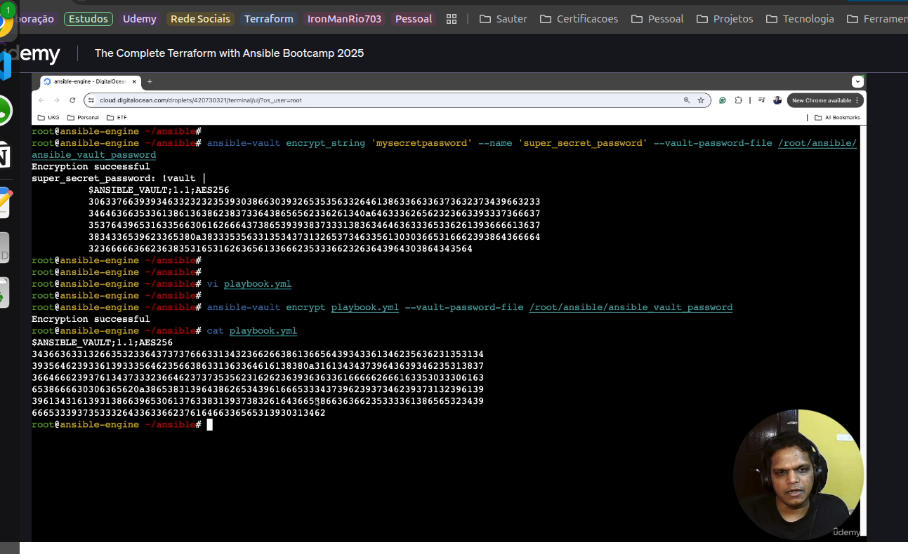

<!-- 
#Encrypt a file: 
ansible-vault encrypt filename

#Decrypt a file
ansible-vault decrypt filename

#View an encrypted file
ansible-vault view filename

#edit an encrypted file
ansible-vault edit filname

#Rekey a file (change password)
ansible-vault rekey filename
 -->

 